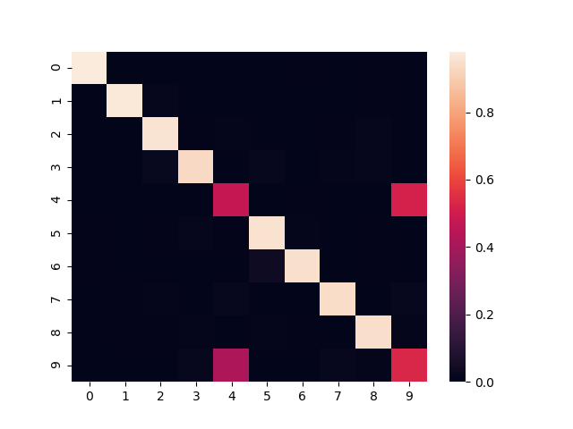

# pt-dec
 

PyTorch implementation of a version of the Deep Embedded Clustering (DEC) algorithm. Compatible with PyTorch 1.0.0 and Python 3.6 or 3.7 with or without CUDA.

This follows (*or attempts to; note this implementation is unofficial*) the algorithm described in "Unsupervised Deep Embedding for Clustering Analysis" of Junyuan Xie, Ross Girshick, Ali Farhadi (<https://arxiv.org/abs/1511.06335>).

## Examples

An example using MNIST data can be found in the `examples/mnist/mnist.py` which achieves around 85% accuracy.

Here is an example [confusion matrix](http://scikit-learn.org/stable/modules/generated/sklearn.metrics.confusion_matrix.html), true labels on y-axis and predicted labels on the x-axis.

## Usage

This is distributed as a Python package `ptdec` and can be installed with `python setup.py install` after installing `ptsdae` from https://github.com/vlukiyanov/pt-sdae. The PyTorch `nn.Module` class representing the DEC is `DEC` in `ptdec.dec`, while the `train` function from `ptdec.model` is used to train DEC.

## Other implementations of DEC

*   Original Caffe: <https://github.com/piiswrong/dec>
*   PyTorch: <https://github.com/CharlesNord/DEC-pytorch> and <https://github.com/eelxpeng/dec-pytorch>
*   Keras: <https://github.com/XifengGuo/DEC-keras> and <https://github.com/fferroni/DEC-Keras>
*   MXNet: <https://github.com/apache/incubator-mxnet/blob/master/example/deep-embedded-clustering/dec.py>
*   Chainer: <https://github.com/ymym3412/DeepEmbeddedClustering>
